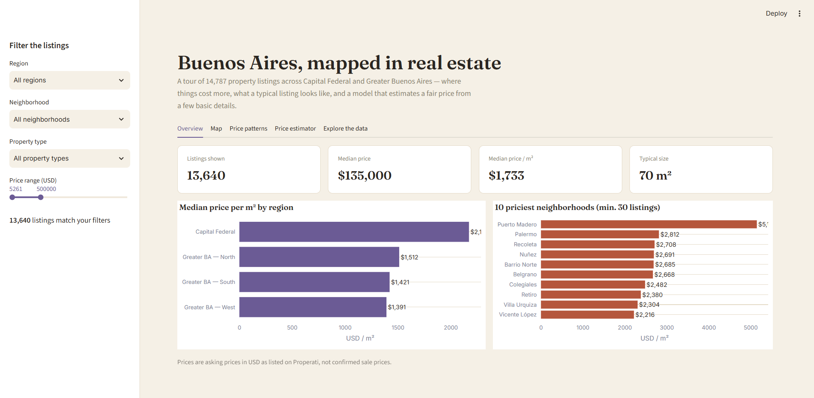
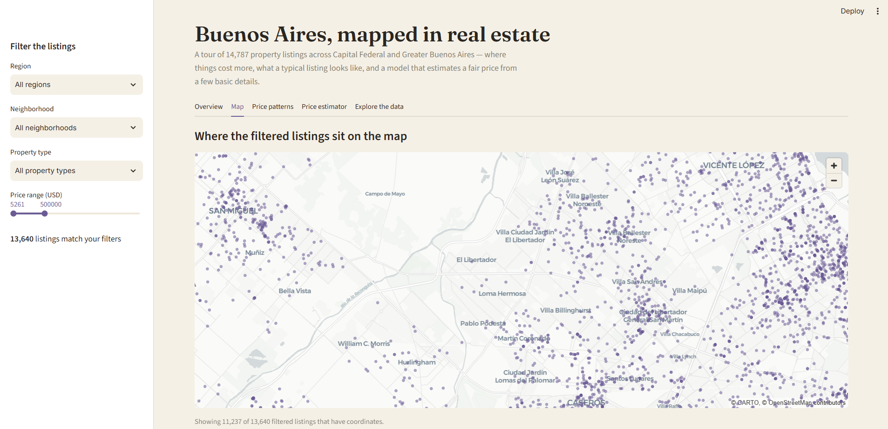
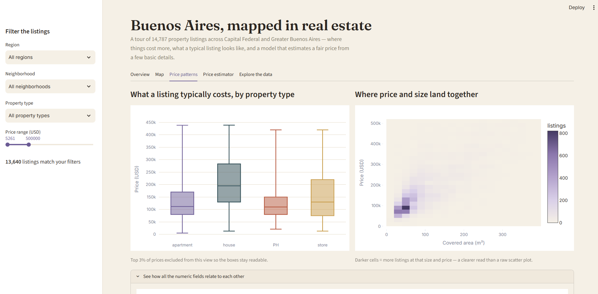
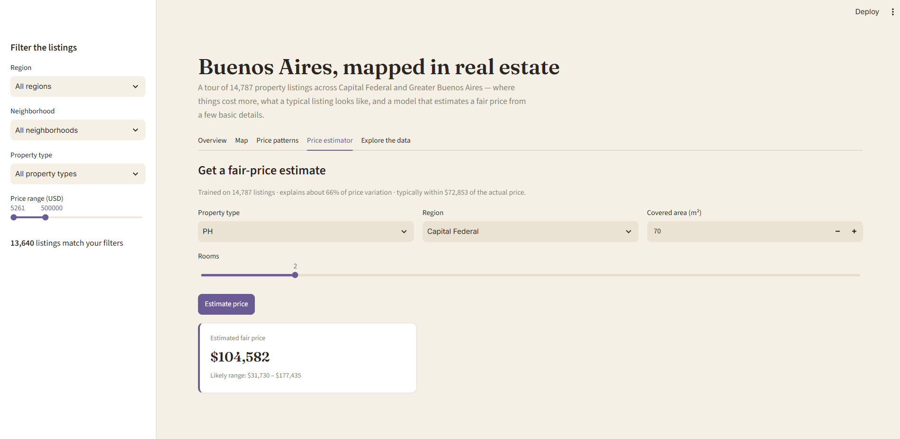
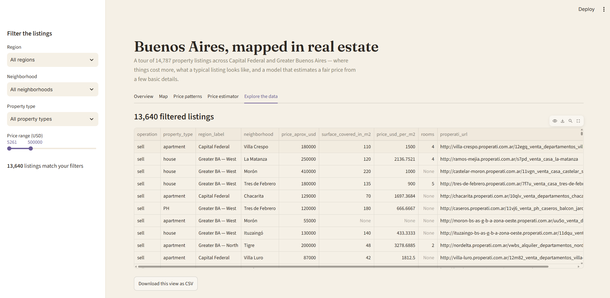

# Buenos Aires, Mapped in Real Estate


---

## What this project is

This is an interactive dashboard that takes **17,212 raw property listings** scraped from Buenos Aires' biggest real-estate portal and turns them into something a normal person can actually use: a clean map, a price-per-neighborhood comparison, and a tool that estimates what a property *should* cost based on its size, type, and location.

**[Try the live app →](#)** *https://property-data-analysis-price-prediction-dashboard.streamlit.app/*

---

## The problem

Raw real-estate data is a mess before anyone can use it. In this dataset:

- Listings arrived in **two separate files** with no indication of whether they overlapped.
- Location was buried inside a single text string like `|Argentina|Capital Federal|Villa Crespo|`, not a usable column.
- Coordinates were jammed into one field as `"-34.6047834183,-58.4586812499"` instead of separate latitude/longitude numbers.
- About **1 in 4 listings** were missing a price entirely, and a handful had obviously broken values — $0 listings, or surface areas in the tens of thousands of square meters.
- None of it was visual. A spreadsheet with 17,000 rows tells a buyer, an analyst, or a recruiter nothing at a glance.

## The solution

I built a small pipeline that does the boring-but-essential work first, then hands the result to an interactive app:

1. **Merge & de-duplicate** — combine both files, drop any repeat listings.
2. **Parse & clean** — split the location string into region and neighborhood, split coordinates into usable numbers, and filter out broken price/size values.
3. **Analyze** — surface the patterns that actually matter: which regions and neighborhoods cost the most, how price relates to size, and how price varies by property type.
4. **Predict** — train a machine learning model that estimates a fair asking price from a few basic inputs (property type, region, size, rooms), so the dashboard isn't just descriptive, it's useful.
5. **Present** — package all of it into a five-tab Streamlit dashboard designed to be read by anyone, not just people who know what a scatter plot is.

## Why I built it

Most portfolio projects stop at "here's a chart." I wanted to go further and answer the questions a real buyer, seller, or analyst would actually ask: *Where is property expensive? What does a typical two-bedroom actually cost? Is this specific listing priced fairly?* That meant treating the cleaning, the analysis, and the design of the final dashboard as equally important — a good model buried in an ugly, confusing interface is still a project nobody will use.

---

## A tour of the dashboard

The app is organized into five tabs, each answering one clear question. Screenshots below are from the live app, filtered live by the sidebar on the left.

### 1. Overview — "Where is property expensive, at a glance?"

Headline numbers (listings shown, median price, median price per m², typical size) plus two ranked bar charts: median price per square meter by region, and the ten priciest neighborhoods. Puerto Madero, Buenos Aires' waterfront financial district, tops the list — which matches reality, a good sanity check that the pipeline is working correctly.

### 2. Map — "Where exactly are these listings?"

Every filtered listing plotted on an interactive map of the city, so the concentration of listings across Capital Federal and the surrounding Greater Buenos Aires zones is visible immediately, not just implied by a table of coordinates.

### 3. Price patterns — "What does a typical listing cost, and how does price relate to size?"

A box plot comparing price ranges across apartments, houses, PH (a common Buenos Aires housing type), and stores — and a price-vs-size density chart on the right. That second chart is deliberately **not** a raw scatter plot: with thousands of points, scatter plots turn into an unreadable cloud. A density heatmap shows the same relationship — darker means more listings at that size and price — without the visual noise.

### 4. Price estimator — "Is this listing priced fairly?"

Type in a property's basic details (type, region, size, rooms) and the trained model returns an estimated fair price along with a likely range, in plain language — no statistics degree required to read it.

### 5. Explore the data — "Let me see the raw listings myself"

The full filtered table, sortable and searchable, with a one-click CSV export for anyone who wants to take the data further in Excel or elsewhere.

---

## Repository structure

```text
ba-real-estate/
│
├── data/
│   ├── buenos-aires-real-estate-1.csv     # Raw export, batch 1 (8,606 listings)
│   └── buenos-aires-real-estate-2.csv     # Raw export, batch 2 (8,606 listings)
│
├── src/
│   └── data_processing.py                 # Merge, clean, and model-training pipeline
│
├── assets/
│   └── screenshots/
│       ├── 01-overview.png
│       ├── 02-map.png
│       ├── 03-price-patterns.png
│       ├── 04-price-estimator.png
│       └── 05-explore-data.png
│
├── .streamlit/
│   └── config.toml                        # Dashboard color theme
│
├── app.py                                 # The Streamlit dashboard itself
├── requirements.txt
├── .gitignore
└── README.md
```

---

## What's under the hood (for the technically curious)

| Stage | What happens | Tools |
|---|---|---|
| **Ingest** | Read both CSV batches, concatenate, de-duplicate on listing URL | Pandas |
| **Parse locations** | Split the pipe-delimited `place_with_parent_names` string into region + neighborhood columns | Pandas `.str.split()` |
| **Parse coordinates** | Split the combined `lat-lon` string into numeric `lat` / `lon` columns | Pandas, `pd.to_numeric` |
| **Clean & filter** | Coerce price/surface/room fields to numeric, back-fill missing price-per-m² where possible, drop listings with implausible prices (<$5k or >$2M) or surface areas (<10m² or >1000m²) | Pandas |
| **Model** | Predict `price_aprox_usd` from property type, region, covered surface area, and room count | scikit-learn `RandomForestRegressor` |
| **Serve** | Five-tab interactive dashboard with live filtering, an interactive map, and on-demand predictions | Streamlit, Plotly, PyDeck |

**Result:** 14,787 of the original 17,212 listings survive cleaning (the rest had unusable prices or sizes). The price model explains roughly **66% of price variation** (R² ≈ 0.66) using only four easy-to-know inputs, with a typical error of about **$73,000** on prices that range from $5,000 to $2,000,000 — a reasonable baseline given how much location-specific detail (exact street, building condition, view) isn't in the raw data at all.

## Key findings

- **Capital Federal commands a real premium.** Median price per m² there is roughly **40–55% higher** than any of the three Greater Buenos Aires zones.
- **Puerto Madero is in a category of its own.** Its median price per m² is roughly double the next-priciest neighborhood (Palermo), reflecting its status as the city's newest, most exclusive waterfront district.
- **Houses carry more price variance than apartments.** Apartments cluster tightly around their median price; houses span a much wider range, which tracks with lot size varying far more than apartment floor plans do.
- **Most listings sit in the same size band.** The price-vs-size density chart shows the bulk of the market clustered under 100m² and under $200,000 — the "typical" Buenos Aires listing is a modest, mid-priced apartment, not the outliers that dominate a raw scatter plot.

---

## Run it yourself

```bash
git clone https://github.com/YOUR_USERNAME/ba-real-estate.git
cd ba-real-estate
python3 -m venv venv
source venv/bin/activate        # Windows: venv\Scripts\activate
pip install -r requirements.txt
streamlit run app.py
```

The app opens automatically at `http://localhost:8501`.

## Deploy it for free (so you have a link to share)

1. Push this repo to GitHub (steps below).
2. Go to [share.streamlit.io](https://share.streamlit.io) and sign in with GitHub.
3. Click **New app**, select this repo, branch `main`, main file `app.py`.
4. Click **Deploy**. In a couple of minutes you'll have a public `*.streamlit.app` link — that's the one to drop into the top of this README and into a LinkedIn post.

## Push to GitHub

```bash
git init
git add .
git commit -m "Buenos Aires real estate dashboard"
git branch -M main
git remote add origin https://github.com/YOUR_USERNAME/ba-real-estate.git
git push -u origin main
```

---

## Tech stack summary

| Tool | Role in this project |
|---|---|
| Python | Core language for the whole pipeline |
| Pandas / NumPy | Merging, cleaning, and feature engineering |
| scikit-learn | Random Forest price-estimation model |
| Streamlit | Interactive web dashboard |
| Plotly | Charts (bar, box, density heatmap) |
| PyDeck | Interactive geospatial map |

## Data attribution

Listings sourced from the Properati Argentina open real estate dataset, covering Capital Federal and the Greater Buenos Aires metropolitan zones (Norte, Oeste, Sur).

---

## Author

**Ajibola Odeyemi**
*Data Analytics & Visualization*

Built to demonstrate an end-to-end workflow: messy raw data in, a decision-ready tool out — the same shape of work involved in most real analytics roles, just on a public dataset instead of a company's internal one.
